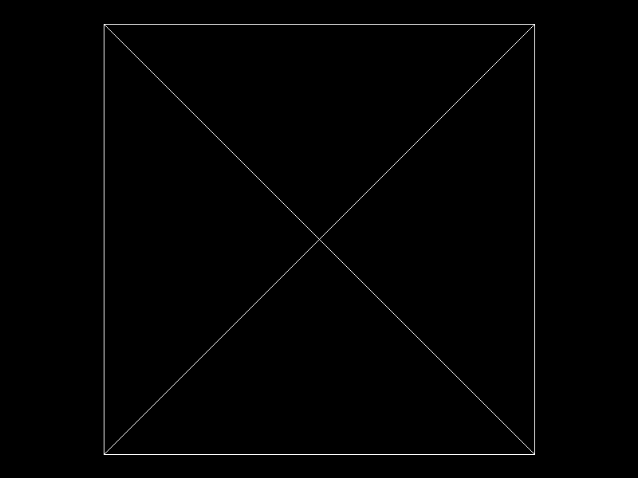

# Proyecto 1 — Parte 1: Dibujando un modelo OBJ

Renderer hecho desde cero en Rust. Carga un modelo `.obj`, recorre todos sus triángulos y los dibuja en un framebuffer propio, sin usar las funciones de Raylib para cargar o dibujar modelos 3D. Raylib se usa únicamente para el tipo `Image`/`Color`/`Vector` y para exportar la imagen final.

## Resultado



## Cómo funciona

```
Archivo OBJ -> Vértices + índices -> Triángulos -> Líneas -> Píxeles -> Imagen
```

- `obj.rs`: `load_obj` lee el archivo y devuelve un `Obj` con `vertices: Vec<Vector3>` e `indices: Vec<usize>` (caras trianguladas, índices base 0).
- `triangle.rs`: `draw_triangle` dibuja el contorno de un triángulo con tres líneas.
- `line.rs`: algoritmo de Bresenham.
- `framebuffer.rs`: buffer de píxeles y exportación a imagen.
- `main.rs`: calcula la caja delimitadora del modelo, lo escala y centra usando solo `x` e `y`, y dibuja cada triángulo.

## Cómo ejecutar

```
cargo run --release
```

El modelo se lee de `model/object.obj` y la imagen se guarda en `render.png` en la raíz del proyecto.

## Modelo utilizado

`model/object.obj`
